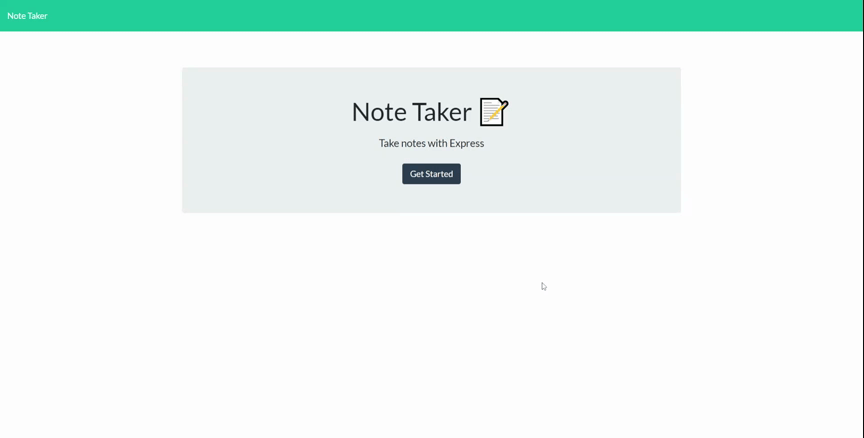

# Note-Taker
  
    
  

  ## Description
  This is a note taker which user can use it to write and save notes. This application is created by Express.js.   [Note Taker]()      

  ## Table of Contents
  * [Installation](#installation)
  * [Usage](#usage)
  * [License](#license)
  * [Contributing](#contributing)
  * [Tests](#tests)
  * [Credits](#credits)
  * [Questions](#questions)

  ## Installation
  Instructions to get the application run:  1. Download and install [Visual Studio Code](https://code.visualstudio.com/Download) if user don't have it installed in the computer.   2. Download and install [Node.js](https://nodejs.org/en/) if user don't have it installed in the computer.   3. Open the terminal, first run `npm install express`:   * `express.js` will create a server to return the data to the client in the form of a response.   The application itself can locate from here [Note Taker]().

  ## Usage
  Note Taker is a web application that can be used to write and save notes. When user opens the Note Taker, then user is presented with a landing page with a link to a notes page:  1. when user clicks on the link to the notes page, then the user is presented with a page with existing notes listed in the left-hand column, plus empty fields to enter a new note title and the note’s text in the right-hand column.  2. when user enters a new note title and the note’s text, then a Save icon appears in the navigation at the top of the page.  3. when user clicks on the Save icon, then the new note user have entered is saved and appears in the left-hand column with the other existing notes.  4. when user clicks on an existing note title in the list in the left-hand column, then that note appears in the right-hand column.  5. when user clicks on the Write icon in the navigation at the top of the page, then user is presented with empty fields to enter a new note title and the note’s text in the right-hand column.  6. when user click on the Delete icon besides the existing note in the list in the left-hand column, then that note is deleted from the list.   

  ## License
  
  This project is under license MIT
  
  [License Link](https://choosealicense.com/licenses/)

  ## Contributing
  Not Available 

  ## Tests
  Not Available 

  ## Credits
  The lists of resources used to complete this challenge:   1. Module 11 Express.js from canvas.   2. Google (https://www.google.ca/)   3. MDN Web Docs (https://developer.mozilla.org/en-US/docs/Web/JavaScript).   4. w3schools (https://www.w3schools.com/).   5. Node.js (https://nodejs.org/dist/latest-v12.x/docs/api/fs.html).   6. npm - express (https://www.npmjs.com/package/express).   7. Insomnia (https://insomnia.rest/).   8. Heroku CLI (https://devcenter.heroku.com/articles/heroku-cli).   9. Supports from instructor, assistant instructor and Tutor.

  ## Questions
  

  For any questions, please contact me with the information below:

  GitHub: [@shanshantina](https://github.com/shanshantina)

  
  Email: tinaxu84@gmail.com
